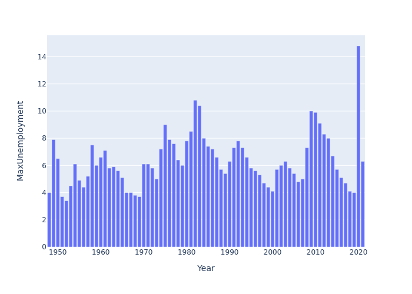

# US Unemployment Calculation as of November 2021

Using data retrieved from https://www.datacommons.org/ using their Pandas integration tool, the results (as of 11/25/2021) are shown below with `MaxUnemployment` representing the maximum unemployment rate for that year. 

